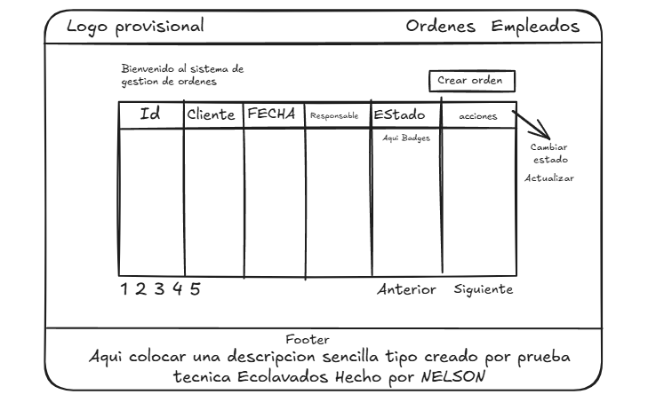
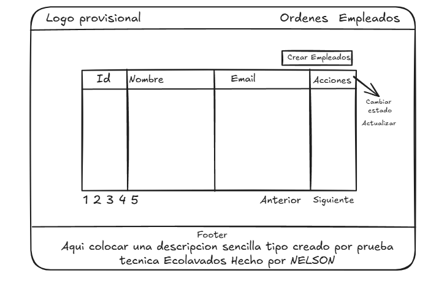

# Prompts

- Modelo usado para el desarrollo: DeepSeek V4 Flash
- Agente de código: Opencode
- Skills utilizadas: `./agents/skills/`
- MCP: Laravel Boost

## Los 5 prompts principales usados durante la prueba

### 1. Creación de vistas estáticas (bocetos iniciales)

> Necesito que desarrolles una vista puede ser la principal con diseño parecido al siguiente [Image 1] la vista puede ser estatica de momento tambien crear otra vista parecida estatica tambien estatica [Image 2] esta guardatala en una carpeta llamada Employee estos son bocetos y no representan el diseño final para tener en cuenta




---

### 2. Seeders con regla de negocio

> @database/seeders/ necesito que aumentes el numero de orders y limites la cantidad de empleados a 5 ten en cuenta las siguientes reglas un conductor solo puede tener mas ordenes relacionadas siempre y cuando esten completadas o canceladas pero si estan pendientes o en ruta no deben ni pueden tener mas con estos estados.

```php
$orders = [

    // Employee 1 — John Doe: starts with a pendiente, then blocked for active

    ['client_name' => 'Juan Pérez', 'order_date' => '2026-01-10', 'employee_id' => 1, 'status' => 'pendiente', 'observations' => 'Entrega urgente'],

    ['client_name' => 'Pedro López', 'order_date' => '2026-01-12', 'employee_id' => 1, 'status' => 'entregado', 'observations' => null],

    ['client_name' => 'Lucía Ramírez', 'order_date' => '2026-01-15', 'employee_id' => 1, 'status' => 'cancelada', 'observations' => 'Cliente canceló'],

    ['client_name' => 'Diego Torres', 'order_date' => '2026-02-01', 'employee_id' => 1, 'status' => 'entregado', 'observations' => null],

    ['client_name' => 'Valeria Castillo', 'order_date' => '2026-03-05', 'employee_id' => 1, 'status' => 'entregado', 'observations' => 'Cliente satisfecho'],


    // Employee 2 — Jane Smith: starts with en_ruta, then blocked for active

    ['client_name' => 'María Gómez', 'order_date' => '2026-01-11', 'employee_id' => 2, 'status' => 'en_ruta', 'observations' => null],

    ['client_name' => 'Carlos Ruiz', 'order_date' => '2026-01-14', 'employee_id' => 2, 'status' => 'entregado', 'observations' => 'Todo en orden'],

    ['client_name' => 'Sofía Herrera', 'order_date' => '2026-02-10', 'employee_id' => 2, 'status' => 'entregado', 'observations' => null],

    ['client_name' => 'Jorge Vargas', 'order_date' => '2026-03-01', 'employee_id' => 2, 'status' => 'cancelada', 'observations' => 'Cambio de proveedor'],


    // Employee 3 — Alice Johnson: all completed/cancelled, can take any

    ['client_name' => 'Ana Martínez', 'order_date' => '2026-01-08', 'employee_id' => 3, 'status' => 'entregado', 'observations' => null],

    ['client_name' => 'Luis Fernández', 'order_date' => '2026-01-20', 'employee_id' => 3, 'status' => 'entregado', 'observations' => 'Cliente feliz'],

    ['client_name' => 'Elena Ríos', 'order_date' => '2026-02-15', 'employee_id' => 3, 'status' => 'cancelada', 'observations' => 'Cancelación solicitada'],

    ['client_name' => 'Pablo Méndez', 'order_date' => '2026-03-10', 'employee_id' => 3, 'status' => 'entregado', 'observations' => null],

    ['client_name' => 'Camila Ortega', 'order_date' => '2026-04-01', 'employee_id' => 3, 'status' => 'entregado', 'observations' => null],

    ['client_name' => 'Andrés Vega', 'order_date' => '2026-04-20', 'employee_id' => 3, 'status' => 'entregado', 'observations' => null],


    // Employee 4 — Bob Brown: all completed, can take any

    ['client_name' => 'Rosa Medina', 'order_date' => '2026-01-05', 'employee_id' => 4, 'status' => 'entregado', 'observations' => 'Entregado a tiempo'],

    ['client_name' => 'Hugo Campos', 'order_date' => '2026-02-05', 'employee_id' => 4, 'status' => 'entregado', 'observations' => null],

    ['client_name' => 'Irene Peña', 'order_date' => '2026-02-28', 'employee_id' => 4, 'status' => 'cancelada', 'observations' => 'Cliente no contactó'],

    ['client_name' => 'Tomás Guerrero', 'order_date' => '2026-03-15', 'employee_id' => 4, 'status' => 'entregado', 'observations' => null],

    ['client_name' => 'Natalia Flores', 'order_date' => '2026-04-10', 'employee_id' => 4, 'status' => 'entregado', 'observations' => null],


    // Employee 5 — Michael Davis: all completed/cancelled, can take any

    ['client_name' => 'Fernando Cruz', 'order_date' => '2026-01-18', 'employee_id' => 5, 'status' => 'entregado', 'observations' => null],

    ['client_name' => 'Lorena Silva', 'order_date' => '2026-02-12', 'employee_id' => 5, 'status' => 'entregado', 'observations' => 'Sin novedades'],

    ['client_name' => 'Ricardo Navarro', 'order_date' => '2026-03-08', 'employee_id' => 5, 'status' => 'cancelada', 'observations' => 'Canceló por lluvia'],

    ['client_name' => 'Patricia Delgado', 'order_date' => '2026-03-22', 'employee_id' => 5, 'status' => 'entregado', 'observations' => null],

    ['client_name' => 'Alberto Reyes', 'order_date' => '2026-04-15', 'employee_id' => 5, 'status' => 'entregado', 'observations' => 'Cliente satisfecho'],

];
```

---

### 3. Paginación en vista de empleados

> Hola, Necesito implementar la paginacion en la siguiente vista @resources/js/pages/Employee/ puede usar el paginate() de eloquent para recibir la estructura de paginacion en @app/Http/Controllers/EmployeeController.php

---

### 4. Filtros por columna tipo Excel

> Necesito que la columna Conductor Y Estado se puedan Filtrar como si fuera una pestañita que se le coloca a un lado en @resources/js/pages/Orders.tsx como si fueran elementos desplegables de la propia columna tipo excel que tiene un boton justo al lado del nombre de las columnas

> si era lo que esperaba pero necesito que el dropdown salga por fuera del contenedor de la tabla ademas de que tenga un tamaño fijo y tenga activado overflow de manera independiente

---

### 5. Cambio de paleta de colores

> bueno necesito que cambies por completo el color del sitio y estilo siguiendo esta paleta de colores #53BB66, #103C61, #FFFFFF trata de mantener todo minimalista sin exagerar estilos ni tampoco colocar gradientes.
